## Laporan Praktikum

|  | Pemrograman Berbasis Framework 2024 |
|--|--|
| NIM |  2141720156|
| Nama |  Versacitta Feodora Ramadhani |
| Kelas | TI - 3I |

### Practicum 1

In this button, three events are assigned with the following;
- When the mouse hovers over the button, a message will appear

- When the mouse clicks the button, a message will appear

- When the mouse hovers out of the button, a message will appear

 

### Practicum 2
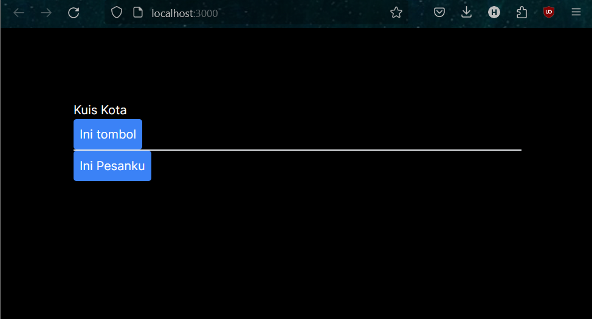
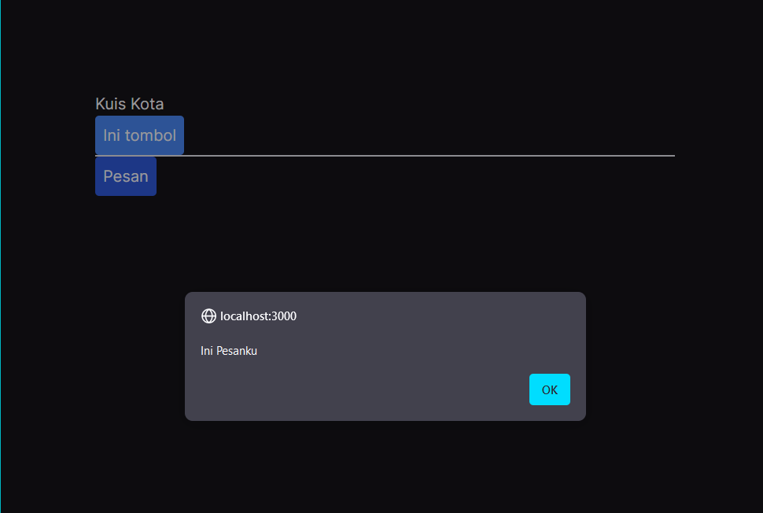
A new button will appear along with the text assigned within namaTombol parameter. When the said button is clicked, a message based on text that has been assigned in isiPesan parameter will appear.
 
As seen in the code, when calling the component `<Tombol2 />`, two parameter are also assigned under the name `isiPesan` and `namaTombol`. Those parameters later are carried over into Tombol2 function as the value within specified variable. In this case, `namaTombol` will become the text inside the button, and `isiPesan` becomes alert message when it is clicked.
 

### Practicum 3
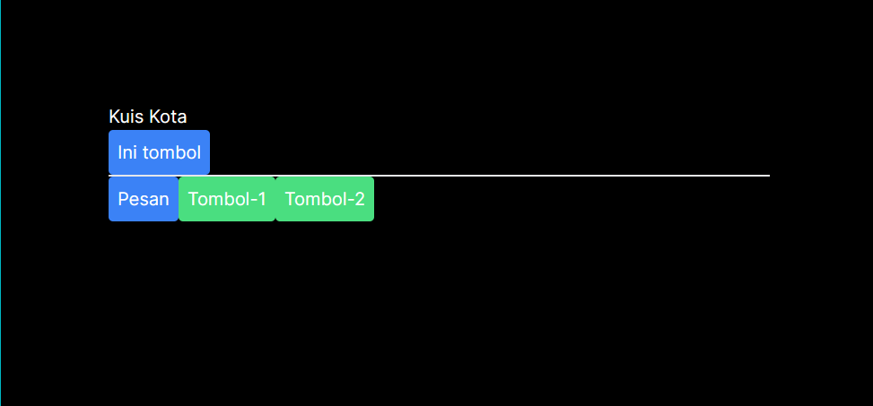
New two green buttons will appear will appear
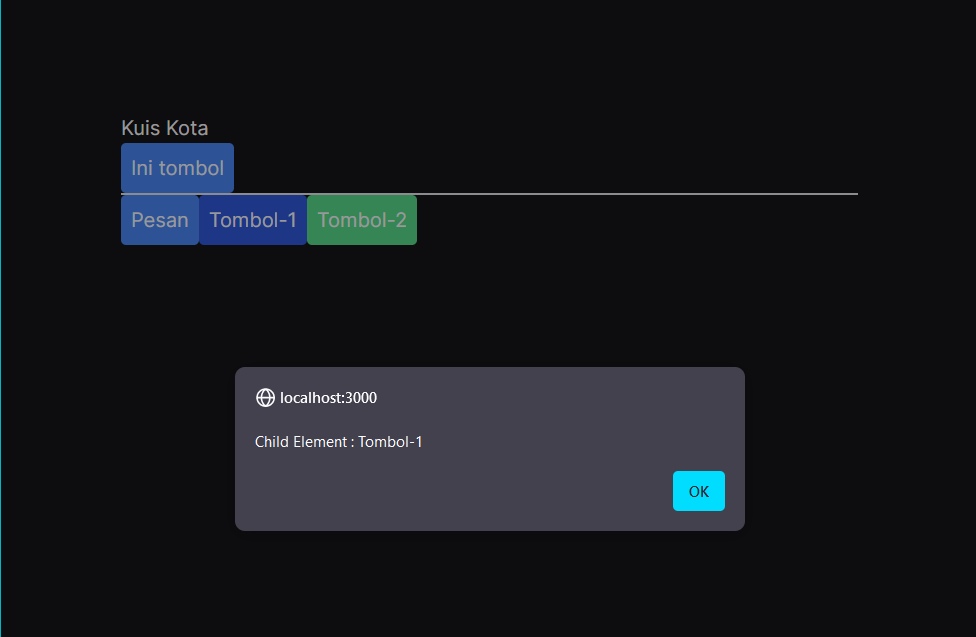
When the first button is clicked, a message will appear corresponding to its parameter
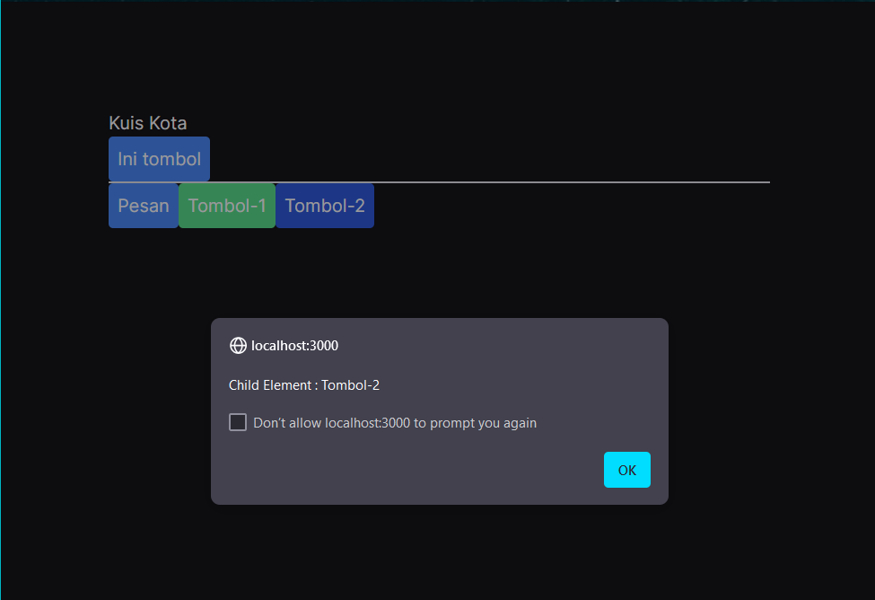
When the second button is clicked, a message will appear corresponding to its parameter

### Practicum 4
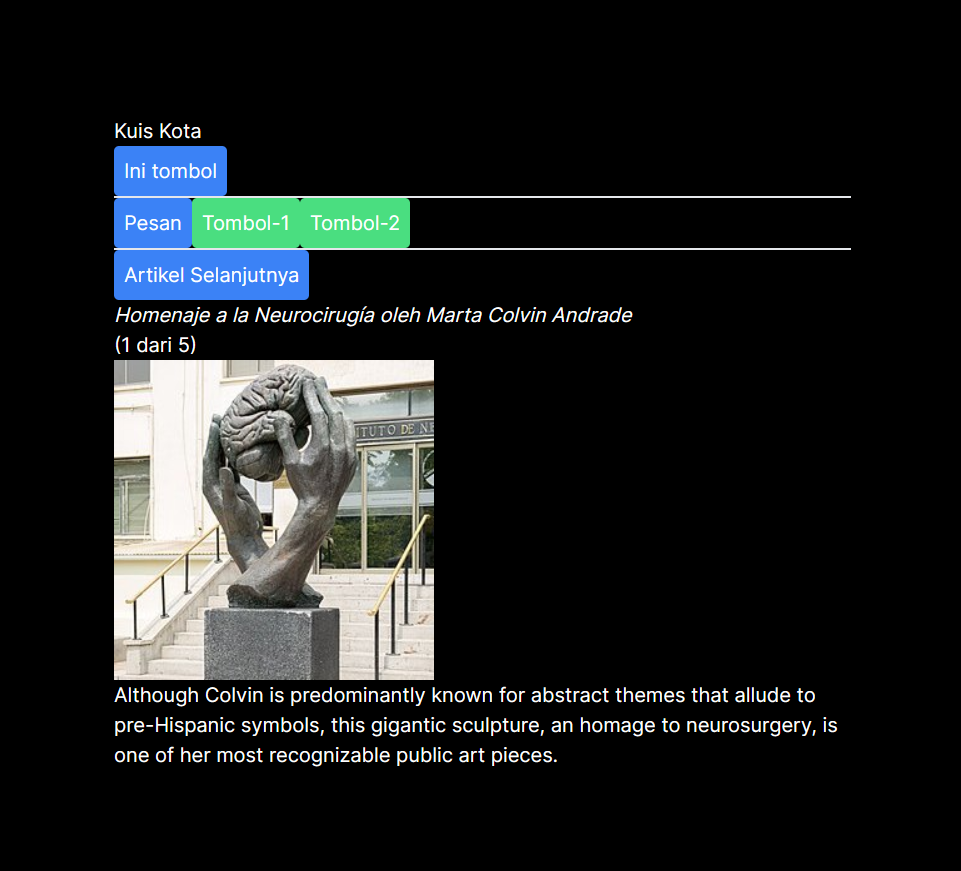
When the button is clicked, a new set of sculpture data (name, image, desc, etc.) will be changed, as well as the number of `... of 5`. It is because the button will increase the current index by 1, thus will call the next set within sculptureList.
 
1. If the button is clicked when the current page is 5 of 5, it will cause an error that declares that the sculpture data isn't exist. This is due to the button iterates the index that exceed the length of the list, which is 5.
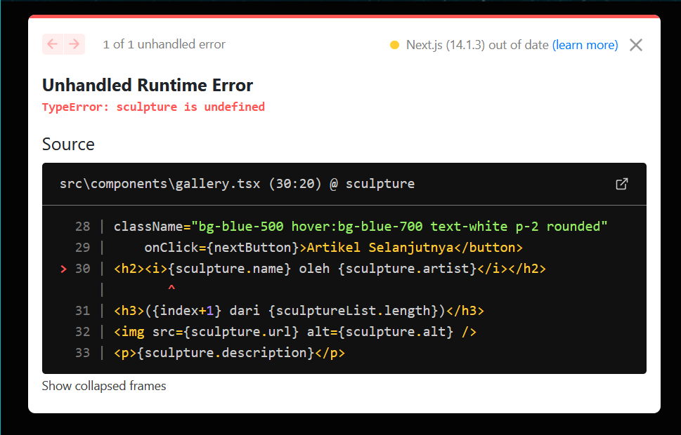
 
2. The solution of this is to have the list go back into the first index within the list, which is 0, when it reaches the last index. This can be achieved by using if statement.
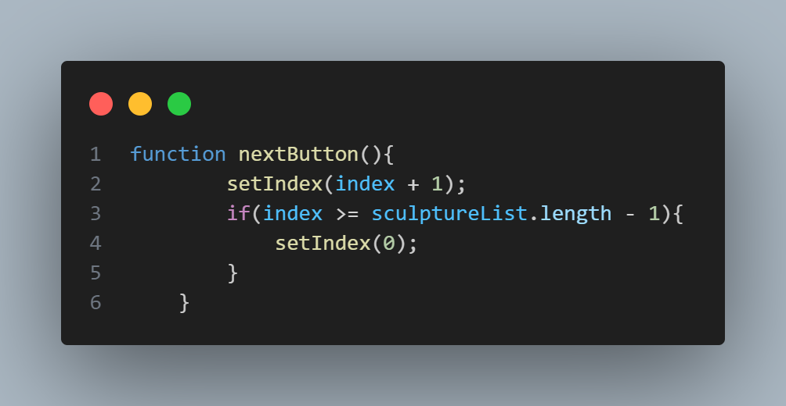
3. The back button is initialized in `gallery.tsx`, where its function will have the index go back by 1. In addition, when it reaches 0, the button will set the index into the last one instead, which is 4.
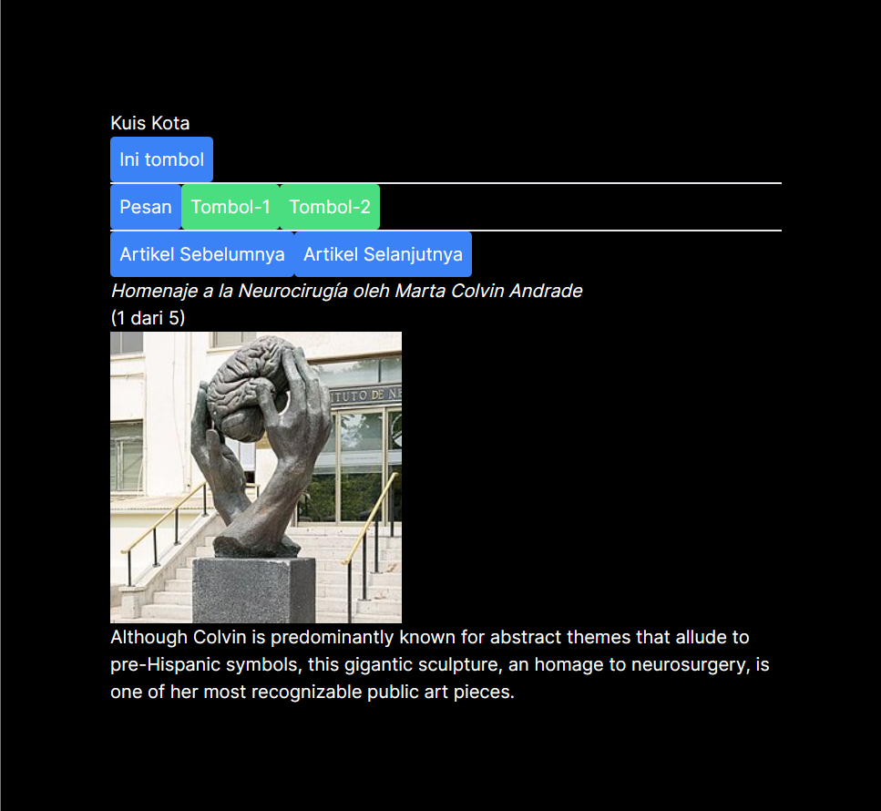
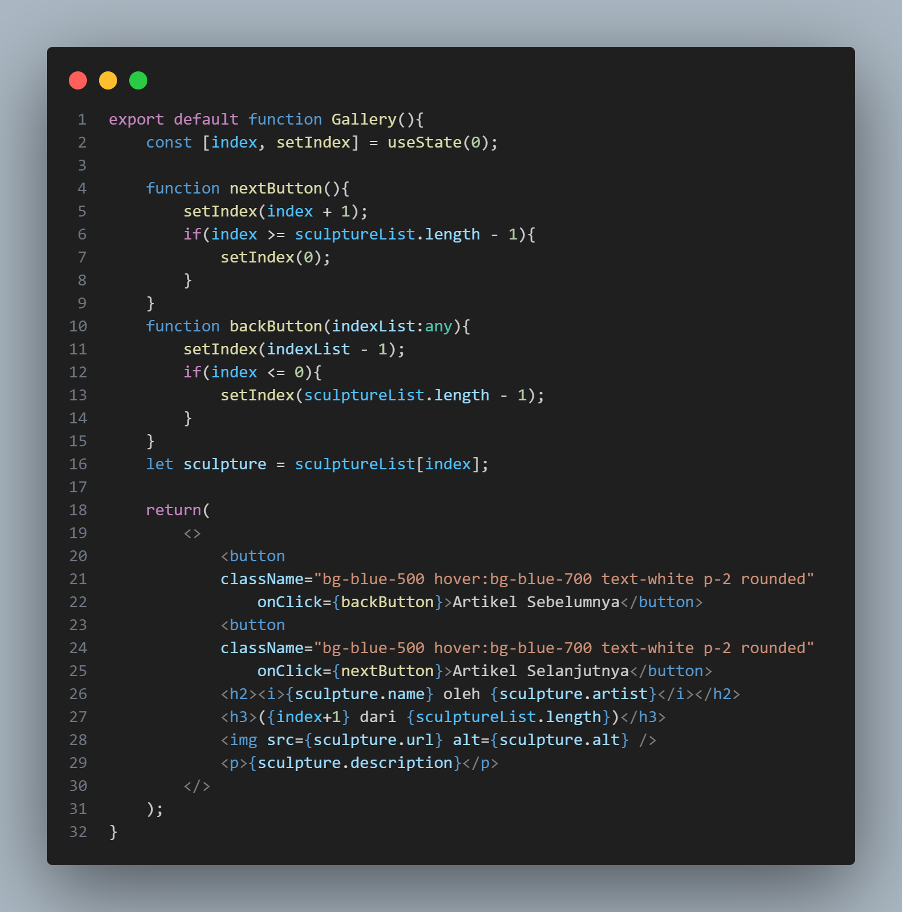
 

### Practicum 5
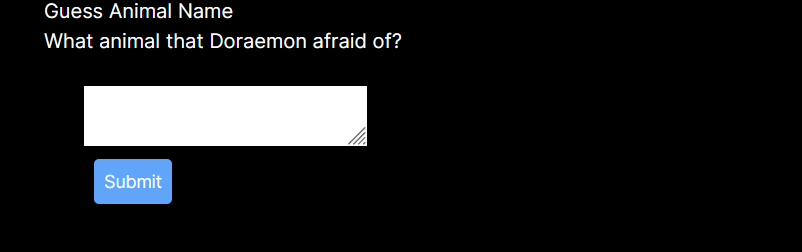
A set of form will appear with the button to submit
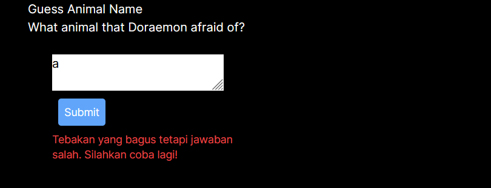
If any wrong answer is inputted, an error message will appear at the bottom of the button

If the right answer is inputted, the entire layout will disappear and a message will appear
  
<b>Input Name form:</b> 
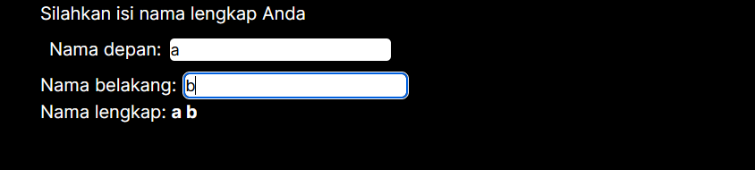
After the code is changed, there is no change in its function and layout whatsoever
 
1. The difference lies within fullName variable. In first form, there is State and Handler for fullname when we change firstName and lastName value, in which it will set combined text of them. While in second one, we declare the combination code immediately after declaring the variable, and thus the function `setFullName()` is removed as well.
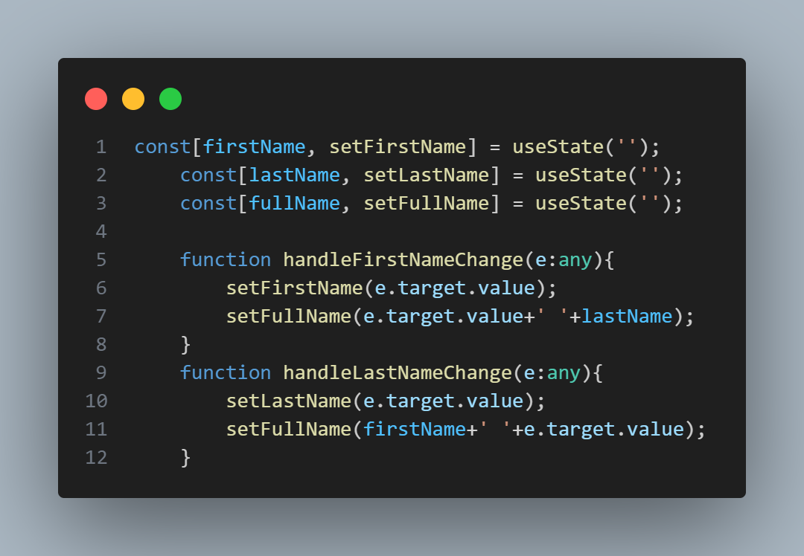
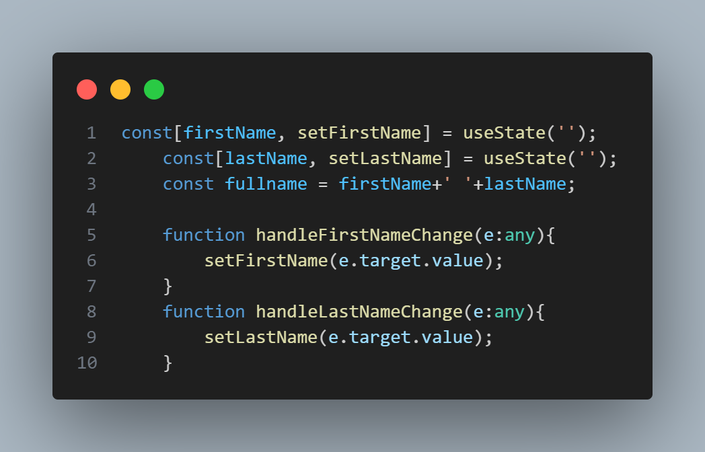
 
2. In terms of development environment, having to recall the handler in so many places may cause the developer to forget to update/apply it, and thus will cause some bugs that will be tedious to resolve. It also requires more time and resources to compute said handler compared to using the constant variable.
 

### Practicum 6
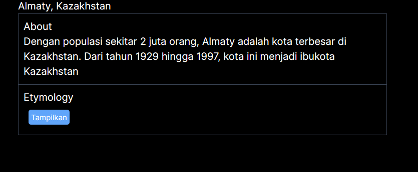
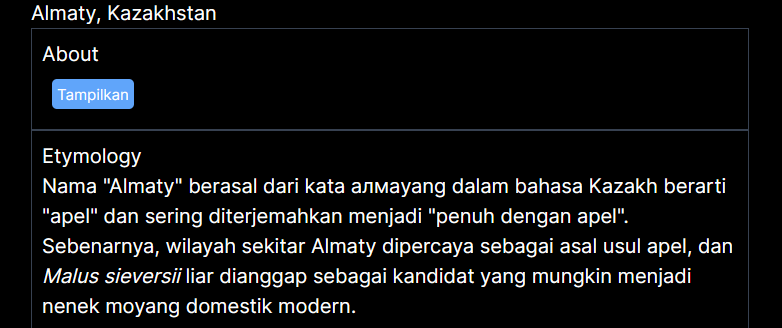
From the picture above, it can be seen that there are two sections regarding Almaty, in which we can hide or show the information based on their corresponding button--if we click on Etymology button, its info will appear and About info will be hidden behind the button, and vice versa.
 
This is because of the if condition within Panel component. If the active state is the same as the current state within Accordion component, it will set the paragraph. If not, it will set the button element instead.
  
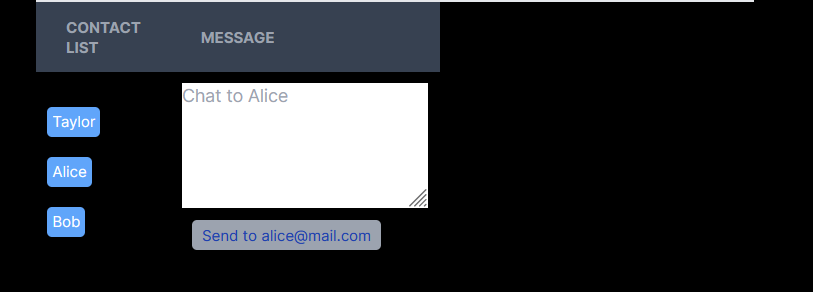
When the key is added, the behavior within the textArea is changed. Before, the text that is filled within the textarea is still preserved even if we move onto another contact/click other button. Afterwards, now that the key is changed, the textarea will be cleared each time we move onto another contact. 
1. The addition of the key is so that whenever a different contact is selected, the Chat component will be recreated from scratch and thus clears out the field.
2. Keys are used to give an identity to the elements in the lists. In this case, whenever its 'identity' is changed, the corresponding component will be recreated in response to match the identity.
