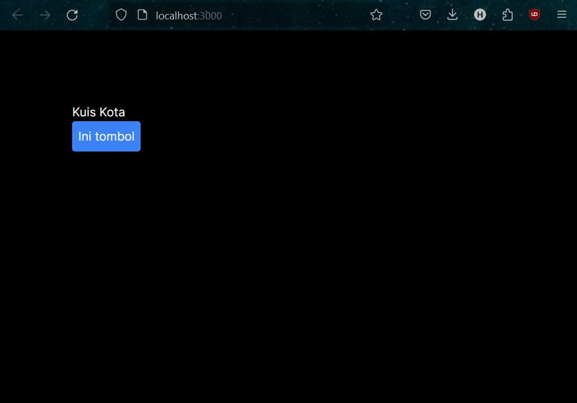
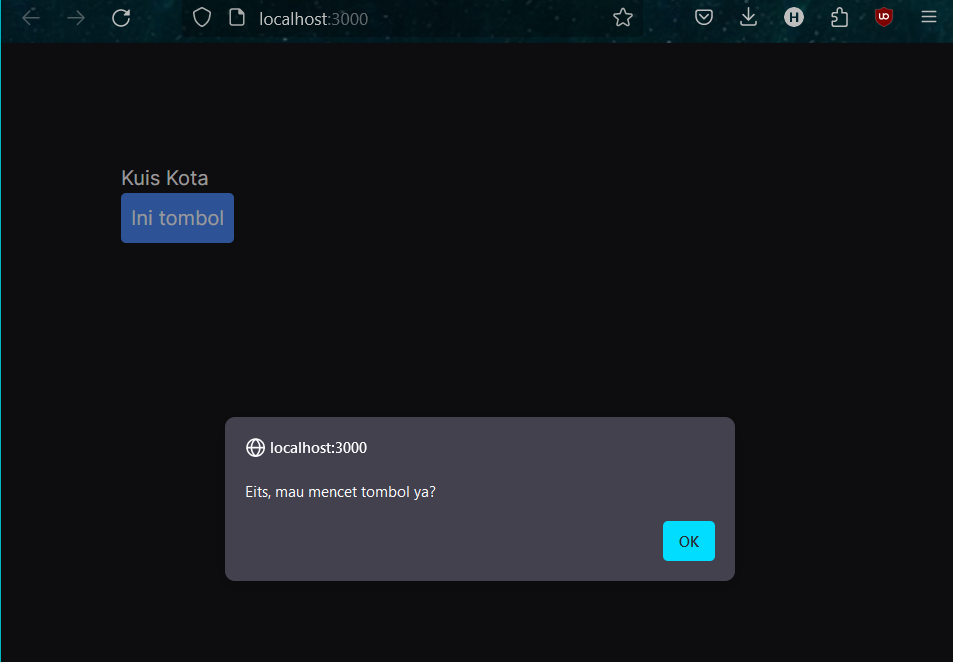
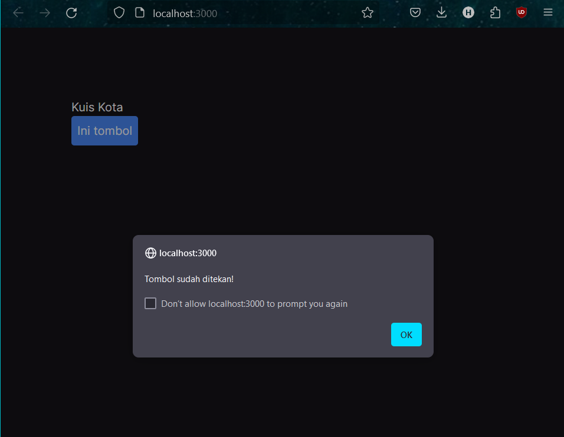
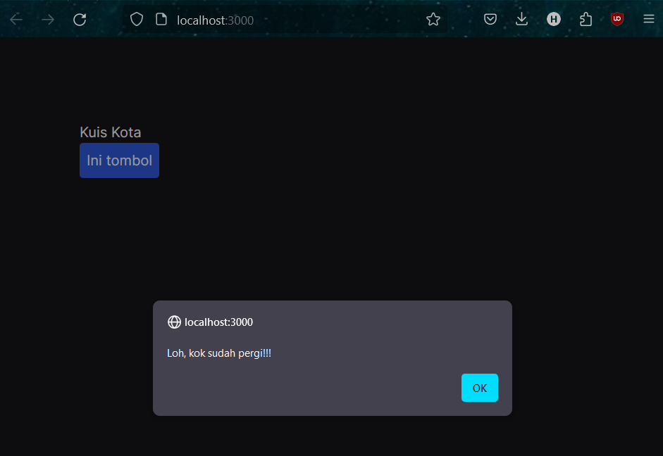

## Laporan Praktikum

|  | Pemrograman Berbasis Framework 2024 |
|--|--|
| NIM |  2141720156|
| Nama |  Versacitta Feodora Ramadhani |
| Kelas | TI - 3I |

### Practicum 1

In this button, three events are assigned with the following;
- When the mouse hovers over the button, a message will appear

- When the mouse clicks the button, a message will appear

- When the mouse hovers out of the button, a message will appear

 

